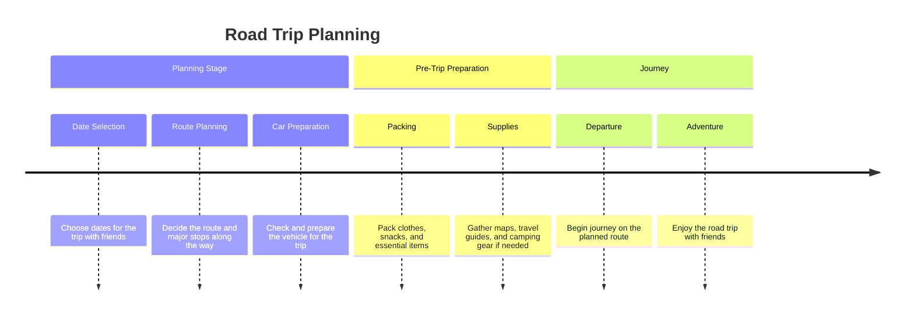

# Mermaid

```mermaid
timeline
    title Road Trip Planning
    section Planning Stage
        Date Selection: Choose dates for the trip with friends
        Route Planning: Decide the route and major stops along the way
        Car Preparation: Check and prepare the vehicle for the trip 
    section Pre-Trip Preparation
        Packing: Pack clothes, snacks, and essential items
        Supplies: Gather maps, travel guides, and camping gear if needed
    section Journey
        Departure: Begin journey on the planned route
        Adventure: Enjoy the road trip with friends
```
