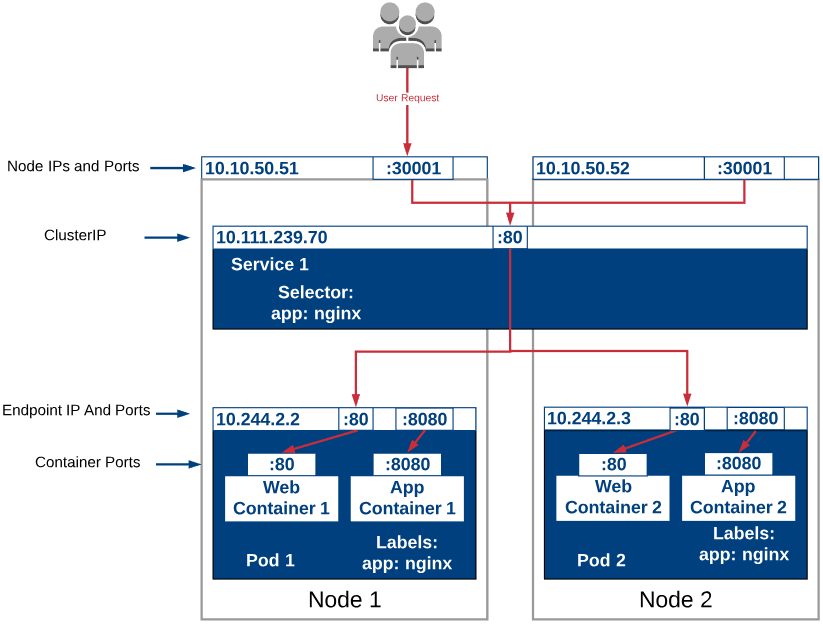

# Traffic 
> We are talking about k8s Traffic & its sub components [Service, Ingress, IngressController, External LoadBalancer, coreDNS, kube-proxy] and its link to Deployment, Daemonset, Pods; ServiceMesh is beyond basic Traffic control & go [here](./k8_adv.md) to learn more;

# Configuration (Usage View)
> Aka how to design mall; How to route traffic, where to put stores; How many hallway?
## Service (Map of Mall)
> default url `my-svc.my-namespace.svc.cluster.local`
> `Service.spec.externalName: test-service.namespace.svc.cluster.local`
> Services, complex encapsulations of network routing rule definitions stored in iptables on cluster nodes and implemented by kube-proxy agents.

> Service.Type=NodePort or Service.Type=LoadBalancer are for none http / https Service

> https://kubernetes.io/docs/concepts/services-networking/connect-applications-service/

## Ports Tracking
> Port are very confusing; Here is port workflow in k8s.

> Here is access table if any help

| Access | Pod / PODs | Service | LoadBalancer | 
| --- | --- | --- | ---  | 
| ClusterIP | `end_point:pod_port` | `service_name:service_port` | --- | 
| NodePort | node_ip:`host_port=pod_port` | node_ip:`host_port=service_port` | --- | 
| LoadBalancer | --- | cluster_ip:`host_port=service_port` | --- | --- | --- | 
| ExternalName | --- | `my-svc.my-namespace.svc.cluster.local` |--- | --- | --- | 
| Internet | --- | --- | `xxx.com/sales` | --- | --- |

#### Port Chaining
> `Deployment.spec.template.spec.containers.ports`/.containerPort = `Service.spec.ports`/.targetPort <-> .port = `Ingress.spec.rules.http.paths`/.path.backend.service.port <-> .path

## Endpoint (Store #)
> endpoints is auto created by CNI, Ex:(10.1.1.1:5000, 10.1.1.2:5000)

## Ingress (Hallway)
> redirect client requested url to Service; Config SSL/TLS

> `kubernetes.io/ingress.class` is older pattern, `IngressClass` is the new standard

> After you enable GKE Loadbalancer API, add this to ingress https://kubernetes.io/docs/tasks/access-application-cluster/create-external-load-balancer/
`Ingress.metadata.annotations.kubernetes.io/ingress.class: "gce"`

> Ingress Controller can config `--default-ssl-certificate` to set wildcard cert; secret(TLS) can't share across namespaces;

# Controller (Manage View)
> Aka how to build mall; How controller of Elevator works; How automatic open door open; where, what & how information in InfoCenter generate;

## IngressController (automatic door controller)
> Common Controller are ingress-nginx, traefik, haproxy
- IngressClass
  - `ingressclass.kubernetes.io/is-default-class: "true"`

## CoreDNS (info center's db)
> custom urls are managed by CoreDNS, which only runs on master node

## kubelet (Building mgr)
> Production clusters should enable Kubelet authentication and authorization.
> > ### kube-proxy (Building info center)
> > Route traffic within building, sync w CoreDNS