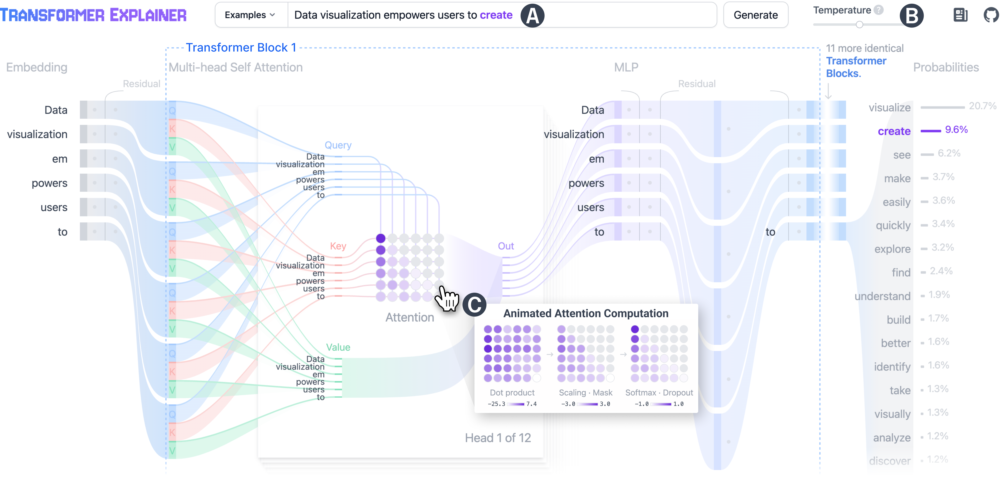

# Transformer Explained

### Generated by GPT-5.1 - narrowed by Terry Wu

Let's look under the hood of Transformer LLMs.

<v-clicks>

- Developer-centric
- Compute + architecture
- Minimal math

</v-clicks>

---

## Outline

<v-clicks depth="2">

- **Goal**: follow the **technical workflow** inside a GPT-style Transformer from prompt text to the next token.
- **Focus**:
  - **Basic**: **chat template**, tokenization, embeddings, and special tokens.
  - **Advanced**: batching, KV cache, MoE routing, prefill vs. decode timing, and RL acting on logits.


</v-clicks>

---

## Visualize GPT-2 Small

Transformer flow from prompt to next-token generation.



---

## Pipeline

We work with a single forward generation step on top of an existing prompt.

<style>
.pipeline-flow {
  font-family: ui-monospace, SFMono-Regular, Menlo, Monaco, Consolas, "Liberation Mono", "Courier New", monospace;
  font-size: 0.84rem;
  line-height: 1.45;
  padding: 0.9rem 1rem;
  border: 1px solid #334155;
  border-radius: 12px;
  background: #020617;
}
.pipeline-group {
  color: #94a3b8;
  margin: 0.45rem 0 0.3rem;
  font-weight: 600;
}
.pipeline-step {
  margin: 0.22rem 0;
  padding: 0.2rem 0.45rem;
  border-left: 4px solid currentColor;
  border-radius: 6px;
  font-weight: 600;
}
.p1 { color: #38bdf8; background: rgba(56, 189, 248, 0.12); }
.p2 { color: #2dd4bf; background: rgba(45, 212, 191, 0.12); }
.p3 { color: #a3e635; background: rgba(163, 230, 53, 0.12); }
.p4 { color: #fbbf24; background: rgba(251, 191, 36, 0.12); }
.p5 { color: #f97316; background: rgba(249, 115, 22, 0.12); }
.p6 { color: #fb7185; background: rgba(251, 113, 133, 0.12); }
.p7 { color: #c084fc; background: rgba(192, 132, 252, 0.12); }
.p8 { color: #60a5fa; background: rgba(96, 165, 250, 0.12); }
.p9 { color: #22d3ee; background: rgba(34, 211, 238, 0.12); }
</style>

<div class="pipeline-flow">
  <div class="pipeline-group">Algorithmic Parts - Prompt Processing</div>
  <div v-click class="pipeline-step p1">-> prompt: str</div>
  <div v-click class="pipeline-step p2">-> chat_template(prompt): str</div>
  <div v-click class="pipeline-step p3">-> tokens: List[int]</div>
  <div v-click class="pipeline-step p4">-> embeddings: matrix[float] (shape ~= [seq_len, d_model])</div>

  <div class="pipeline-group">Computation Core</div>
  <div v-click class="pipeline-step p5">-> residual_stream: matrix[float] (model computation happens here)</div>

  <div class="pipeline-group">Algorithmic Parts - Decode Loop</div>
  <div v-click class="pipeline-step p6">-> logits: lm_head(residual_stream[-1]) (shape ~= [vocab_size])</div>
  <div v-click class="pipeline-step p7">-> decode: greedy~argmax(logits) or sample~softmax(logits)</div>
  <div v-click class="pipeline-step p8">-> token: int</div>
  <div v-click class="pipeline-step p9">-> text_piece: str</div>
  <div v-click class="pipeline-step p1">-> append to prompt and repeat (autoregressive)</div>
</div>

<v-clicks>

- **Autoregressive**: each step predicts exactly one new token conditioned on all previous tokens.
- **Residual stream**: shared vector at each position that all attention/MLP blocks read and write.
- The generation loop continues until `<|endoftext|>` or another stop condition.

</v-clicks>

---

## Transformer = Algorithmic Parts + Computation Core
<br/>
<div class="grid grid-cols-2 gap-6">
<div>

### Algorithmic Parts
<v-clicks>

- Implemented by classic Python code.
- Chat template:
  - Message formatting (for example: role, channel, tool).
  - Context management (for example system message, relevance context).
  - LLM-controlled variables (for example `thinking_effort`).
- Encoding logic.
- Decoding strategy (temperature, greedy, top-k, draft tokens).
- Batching policy and its complications.
- KV-cache management and scheduling.


</v-clicks>
</div>
<div>

### Computation Core
<v-clicks>

- [**Model architecture**](https://github.com/karpathy/nanochat/blob/4a87a0d19f30799b6c700285822dcca850adf6a4/nanochat/gpt.py#L133):
  - Attention block:
    - Position encoding (RoPE).
    - Attention pattern.
  - Feed-forward block:
    - Dense MLP.
    - Mixture-of-Experts (MoE) MLP.
  - Number of layers ~= depth and `d_model` ~= width.
- Training:
  - Pre-training.
  - **Reinforcement learning** (RL) pipelines.
- Post-training:
  - Mechanistic interpretability.
  - Safety analysis


</v-clicks>

</div>
</div>

---

## Chat Template

<v-clicks>

Every chat model ships with a [**chat template**](https://huggingface.co/openai/gpt-oss-120b/blob/main/chat_template.jinja?utm_source=chatgpt.com) that takes JSON messages as input and renders the **final text prompt** for the model.

Look in `config.json` or `chat_template.jinja`.

Example:
```jinja {1-3|10-14|15-18}
<|startoftext|>
<|system|>
You are a coding assistant. Use tools when needed.
<|user|>
What files are in /tmp?
<|assistant|>
I will inspect the directory.
<|call|>
list_files(path="/tmp")
<|return|>
["a.txt", "notes.md", "script.py"]
<|assistant|>
The /tmp folder contains:
- a.txt
- notes.md
- script.py
<|endofprompt|>

```


</v-clicks>

---

## Reserved Tokens Like SQL Keywords

GPT-OSS defines reserved special tokens in tokenizer config, mapped to high-ID entries. [Reference](https://huggingface.co/openai/gpt-oss-120b/blob/main/tokenizer_config.json?utm_source=chatgpt.com)

Recommended practice: remove reserved tokens from user inputs to reduce injection risk.

<div class="grid grid-cols-2 gap-6">
<div>

### Key Reserved Tokens


- `<|startoftext|>`: sequence start; often combined with system prompt.
- `<|endoftext|>`: sequence end / stop condition.
- `<|endofprompt|>`: boundary between prompt and model response.
- `<|call|>`: marks tool call segments.
- `<|return|>`: marks tool return segments.


</div>
<div>

### Why They Matter

- Let one model handle **multiple channels** (thoughts, tools, final answer) in one flat token sequence.
- Tokenizer config ensures these tokens are **never split** and are treated as atomic IDs.
- Inference engines must honor them when:
  - stripping tool calls,
  - hiding chain-of-thought,
  - routing to tools.


</div>
</div>

---

## Modern Tokenizer Coverage

Modern GPT-style tokenizers mix curated tokens with byte-level fallback so any input, from chat text to binary blobs, can be represented.

<div class="grid grid-cols-2 gap-6">
<div>

### Base Vocabulary


- Many common ASCII characters and substrings are directly represented in the vocabulary.
- Common numerals and short number strings often have dedicated tokens.

</div>
<div>

### Byte-Level Fallback

- Tokenizers can fall back to raw byte tokens `0`-`255`, so arbitrary Unicode or binary data stays encodable.
- Worst case is about four tokens per character, but coverage is guaranteed.


</div>
</div>

So the tokenizer always has a way to break any string into tokens.

---

## Algorithmic Parts

<div class="grid grid-cols-2 gap-6">
<div>

### Encode

Embeddings (beginning of the residual stream)

- **Messages**: structured input list before chat-template rendering.
- **Chat template**: converts structured messages into a flat prompt string.
- **Tokenizer** maps text to IDs via BPE; includes reserved tokens like `<|startoftext|>`, `<|endoftext|>`, `<|endofprompt|>`. [tokenizer_config.json](https://huggingface.co/openai/gpt-oss-120b/blob/main/tokenizer_config.json?utm_source=chatgpt.com)
- **Embedding table**: `matrix[float]` with shape `[vocab_size, d_model]`; maps `token:int` -> `embedding:vector[d_model]`.


</div>
<div>

### Decode

Residual stream -> logits -> token -> text


- For each layer `l` and position `t`, maintain `R[l, t] in R^d_model` (residual stream).
- Each block (attention, MoE-MLP) reads `R` and adds its contribution back into `R`.
- Final layer projects `R[last_layer, last_token]` through `W_lm_head` -> logits in `R^vocab_size`.
- `softmax(logits)` -> probabilities; decoder chooses next token via greedy or sampling.


</div>
</div>

---

## Advanced Inference Performance

<div class="grid grid-cols-2 gap-6">
<div>

### 1. Static and Continuous Batching


- **Static batching**: group `N` prompts into `[N, seq_len]` for prefill to amortize kernel launch and memory traffic. [MLX Batch SDK](https://github.com/ml-explore/mlx-lm/blob/ba2cf3c0ee72e6a8f927009c6ffe8db913decb49/mlx_lm/generate.py#L1088)
- **Continuous batching**: add/remove sequences mid-flight so GPUs stay full as requests start/finish. [vLLM scheduler](https://github.com/vllm-project/vllm/blob/v0.2.7/vllm/core/scheduler.py#L217-L262)

```python {2-4}
# schematic (not exact MLX code)
for step in steps:
    batch = scheduler.next_ready_requests()
    logits, kv_cache = model(batch.tokens, kv_cache)
    scheduler.feed_logits(batch, logits)
```

</div>
<div>

### 2. KV Cache (Key/Value Cache)


- During prefill, attention keys and values for each layer/token are stored in the KV cache.
- During decode, new tokens attend to cached past tokens instead of recomputing the full prefix.
- Cost per step is about `O(context_length)` instead of `O(context_length^2)`.
- Algorithmic design includes:
  - cache layout (for example paged KV, GPU-friendly strides),
  - lifetime/eviction policy,
  - KV sharing between draft and target models.


</div>
</div>

---

## GPT-OSS-120B Architecture Snapshot

GPT-OSS-120B is a **Transformer with Mixture-of-Experts (MoE) layers**.

<div class="grid grid-cols-2 gap-6">
<div>

### Key Hyperparameters


- **Layers**: [36 Transformer blocks](https://huggingface.co/openai/gpt-oss-120b/blob/main/config.json#L15).
- **Hidden size** `d_model`: 2880.
- **Attention**:
  - Head dim: 64.
  - Grouped multi-query attention; `num_key_value_heads = 8`.
  - Alternating dense and locally banded sparse patterns for long context.
- **Context length**: up to about 128k tokens, depending on runtime.

</div>
<div>

### MoE and Quantization

- **Mixture-of-Experts (MoE)**:
  - 128 experts per MoE layer, 4 experts active per token. [CometAPI note](https://www.cometapi.com/gpt-oss-120b/?utm_source=chatgpt.com)
  - 117B total params, about 5.1B active per token forward pass. [OpenAI note](https://openai.com/index/introducing-gpt-oss/?utm_source=chatgpt.com)
- **Routing**: learned router picks top-k experts per token.
- **Quantization**: native MXFP4 config in `config.json` for efficient FP4 runtimes.
- All transforms operate on residual stream; algorithmic code decides *when* to call the model.


</div>
</div>

---

## Prefill vs Decode

The [Transformer Explainer](https://poloclub.github.io/transformer-explainer/) shows a live GPT-2 model and visualizes attention and MLP steps.

<div class="grid grid-cols-2 gap-6">
<div>

### Prefill Phase (Parallel, Compute-Intensive)

- Input: whole prompt tokens `[t1 ... tL]`.
- All positions processed in parallel:
  - compute KV for each layer/token,
  - feed-forward network,
  - all token logits and probabilities.
- Ideal for large batches and high GPU utilization.
- This is the same broad mode used during large-scale pre-training.

</div>
<div>

### Decode Phase (Serial, Memory-Intensive)


- Loop over steps:


```python {2-4}
for step in range(max_new_tokens):
    # feed only latest token
    # attend over KV cache (prefix)
    # update KV with the new token
```


- **Serial dependency**: token `t+1` depends on token `t`, so less parallel than prefill.
- Memory-bound: KV cache grows as `O(L * layers * d_head)`.


</div>
</div>

---

## Greedy, Sampling, and Speculative Decoding

<div class="grid grid-cols-2 gap-6">
<div>

### Greedy vs Top-k / Temperature

- **Greedy**: `argmax(logits)` each step.
  - Deterministic and fastest.
  - Can be repetitive or brittle.
- **Top-k sampling**:
  - Keep the top-k logits, then renormalize.
  - Use `softmax(logits / temperature)` to sample.
- **Top-p (nucleus)**:
  - Use smallest token set whose cumulative probability is `>= p`.
  - Adapts to peaked vs flat distributions.

</div>
<div>

### Speculative Decoding (Draft + Target)

- Use a small **draft model** to propose multiple tokens in parallel.
- Large **target model** validates in one batched pass:
  - accept draft prefix when probabilities agree,
  - reject and fall back when they diverge.
- Core tradeoff: extra FLOPs for fewer serial steps in the large model.
- KV-cache sharing between draft and target is another optimization layer.

</div>
</div>

---

## Reinforcement Learning = Adjusting Logits

High level: RL modifies model parameters so generation-time **logits** align better with reward signals.

<div class="grid grid-cols-2 gap-6">
<div>

### What RL Touches

- Observe trajectory: prompt, generated tokens, reward.
- Token log-probs come from logits: `log pi_theta(a | s)`.
- RL updates nudge `theta` to:
  - increase log-prob of high-reward sequences,
  - decrease log-prob of low-reward sequences.
- In practice: PPO-style RLHF or RLAIF on top of supervised pre-training.

</div>
<div>

### Diverse and Verified Solutions

- Think of RL as a lottery factory:
  - LLM generates many candidate answers (token sequences),
  - humans or a reward model validate which answers are good.
- RL reshapes the distribution so:
  - good answers become more common,
  - some entropy remains for diversity and exploration.

</div>
</div>

---

## Thank You


- We covered: **prompt -> tokens -> embeddings -> residual stream -> logits -> decoding**.
- We separated **algorithmic parts** (template, batching, KV cache, decoding, speculative decode) from **computation core** (architecture and training).
- We connected **RL** directly to **logit shaping**.
