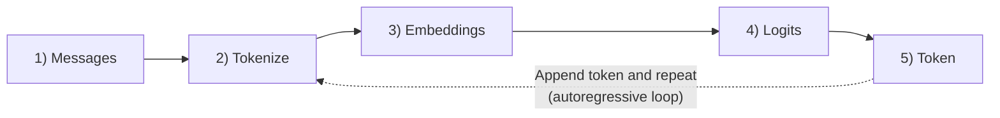
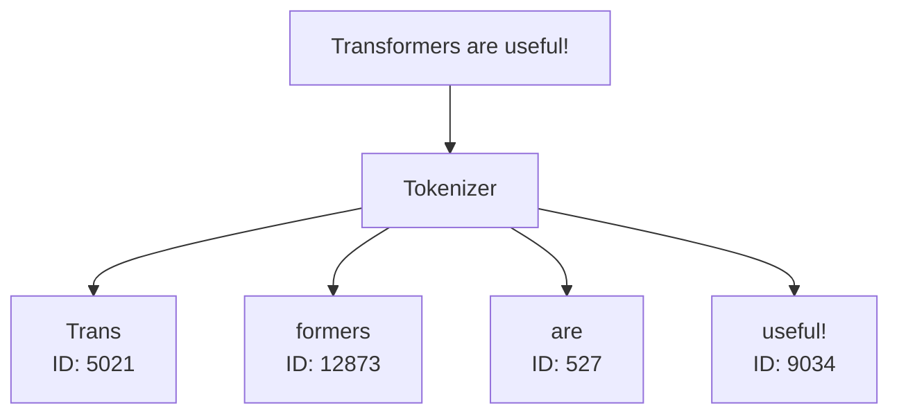
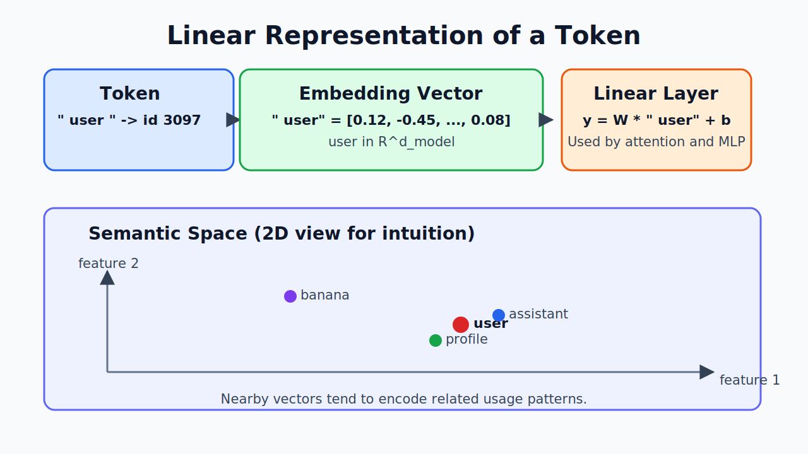
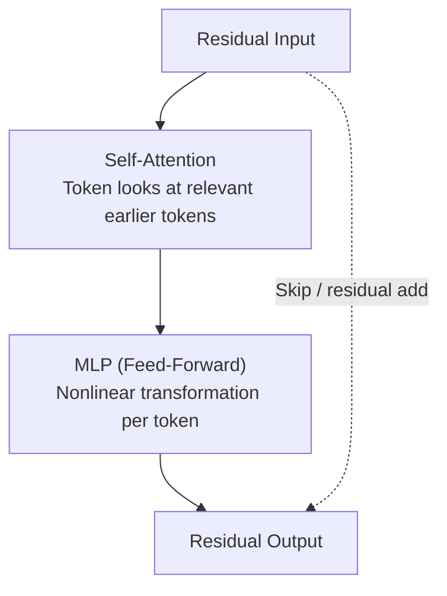

<style>
.slidev-page code,
.slidev-page pre,
.slidev-page pre code {
  font-variant-ligatures: none;
  font-feature-settings: "calt" 0, "liga" 0;
}
</style>

# Transformer Pipeline for Developer

<v-clicks>

- Developer-focus mental model
- Focus on inference pipeline
- Minimal math, practical terminology

</v-clicks>

---

## Learning Goals

By the end, you should be able to explain:

<v-clicks>

- How chat messages become model input text
- How text becomes token IDs
- What happens inside Transformer blocks
- Why `prefill` and `decode` have different performance
- How logits become final output tokens

</v-clicks>

---

## Big Picture Pipeline



<v-click>

The model repeats this loop one token at a time. That is why it is called **autoregressive generation**.

</v-click>

---

## Step 1: Conversation -> Final Prompt

<div class="grid grid-cols-2 gap-6">
<div>
<br/>

- Chat apps store conversation as **json**.
- A conversation has many messages
  - Each message has role(security control) + content.
- A **chat template** converts json into **Final Prompt**.

</div>
<div>

### Example: json

```json
[
  {"role": "system", "content": "You are concise."},
  {"role": "user", "content": "Explain Transformers simply."}
]
```

### Example: Final Prompt

```txt
<|system|> You are concise.
<|user|> Explain Transformers simply.
<|assistant|>
```

</div>
</div>

---

## Step 2: Prompt Text -> Tokens



<v-clicks>

- Tokenizers split text into variable-length chunks.
- Each chunk maps to an integer ID.
- Special tokens (for role boundaries/tool markers) are reserved IDs.

</v-clicks>

---

## Step 3: Tokens -> Embeddings

<div class="grid grid-cols-2 gap-6">
<div>

### Embedding Lookup

- Input IDs index an embedding table.
- Table shape is usually `[vocab_size, d_model]`.
- Output shape is `[seq_len, d_model]`.

</div>
<div>

### Intuition

- Token IDs are like zip codes.
- Embeddings are dense semantic vectors.
- Nearby meanings often become nearby vectors.

</div>
</div>



---

## Step 4: Transformer Block

- Transformer Block has many Attention Heads.
  - Attention Heads specialize different aspects(Ex: syntax, logic, sentiment).
    - **Self-attention** mixes information across tokens.
      - Attention score defines how much token relates others tokens.
    - **MLP** transforms each token representation.

<div style="height:200px; width: 200px; margin:auto">



</div>

---

## Attention Intuition (No Heavy Math)

<script setup>
import { computed, ref } from 'vue'
import {
  ATTENTION_HEADS,
  ATTENTION_TOKENS,
  formatTokenLabel,
  getCellStyle,
} from './graph.js'

const activeHeadKey = ref('head1')
const selectedQueryIndex = ref(ATTENTION_TOKENS.length - 1)
const selectedKeyIndex = ref(ATTENTION_TOKENS.length - 1)

const tokenLabels = ATTENTION_TOKENS.map(formatTokenLabel)
const activeHead = computed(() => ATTENTION_HEADS[activeHeadKey.value])
</script>

<div class="attention-slide">
  <p class="attention-token-note">
    Tokenizer chunks from slide 5:
    <code>Trans</code>, <code>formers</code>, <code> are</code>, <code> useful!</code>
  </p>

  <div class="attention-head-buttons">
    <button
      type="button"
      class="attention-head-btn"
      :class="{ active: activeHeadKey === 'head1' }"
      @click="activeHeadKey = 'head1'"
    >
      Attention Head 1 (Sentiment)
    </button>
    <button
      type="button"
      class="attention-head-btn"
      :class="{ active: activeHeadKey === 'head2' }"
      @click="activeHeadKey = 'head2'"
    >
      Attention Head 2 (Syntax)
    </button>
  </div>

  <p class="attention-head-note">
    {{ activeHead.note }}
  </p>

  <div class="attention-table-wrap">
    <table class="attention-table">
      <thead>
        <tr>
          <th class="attention-axis">Query / Key</th>
          <th
            v-for="(token, colIndex) in tokenLabels"
            :key="`header-${colIndex}`"
            class="attention-axis"
          >
            <button
              type="button"
              class="attention-key-btn"
              :class="{ active: selectedKeyIndex === colIndex }"
              @click="selectedKeyIndex = colIndex"
            >
              {{ token }}
            </button>
          </th>
        </tr>
      </thead>
      <tbody>
        <tr
          v-for="(row, rowIndex) in activeHead.matrix"
          :key="`${activeHeadKey}-row-${rowIndex}`"
        >
          <th class="attention-row-label">
            <button
              type="button"
              class="attention-query-btn"
              :class="{ active: selectedQueryIndex === rowIndex }"
              @click="selectedQueryIndex = rowIndex; if (selectedKeyIndex > rowIndex) selectedKeyIndex = rowIndex"
            >
              {{ tokenLabels[rowIndex] }}
            </button>
          </th>
          <td
            v-for="(score, colIndex) in row"
            :key="`${activeHeadKey}-${rowIndex}-${colIndex}`"
            class="attention-cell-wrap"
          >
            <button
              type="button"
              class="attention-cell"
              :class="{
                'attention-cell-active': selectedQueryIndex === rowIndex && selectedKeyIndex === colIndex,
                'attention-cell-masked': colIndex > rowIndex,
              }"
              :style="getCellStyle(score, colIndex > rowIndex)"
              :disabled="colIndex > rowIndex"
              @click="selectedQueryIndex = rowIndex; selectedKeyIndex = colIndex"
            >
              {{ score.toFixed(2) }}
            </button>
          </td>
        </tr>
      </tbody>
    </table>
    <p class="attention-hint">
      Darker green = higher attention score. Gray cells are causally masked (future tokens), so they are disabled.
    </p>
    <p class="attention-footnote">
      Footnote: attention heads specialize in different patterns through training. We can observe behaviors like
      sentiment or syntax focus, but we do not directly design or dictate each head's exact specialization.
    </p>
  </div>
</div>

<style>
.attention-slide {
  font-size: 0.8rem;
}
.attention-token-note {
  margin: 0.1rem 0 0.5rem;
  color: #14532d;
}
.attention-head-buttons {
  display: flex;
  gap: 0.55rem;
  flex-wrap: wrap;
  margin-bottom: 0.4rem;
}
.attention-head-btn {
  border: 1px solid #166534;
  background: #f0fdf4;
  color: #14532d;
  padding: 0.3rem 0.62rem;
  border-radius: 999px;
  font-size: 0.72rem;
  font-weight: 650;
  cursor: pointer;
}
.attention-head-btn.active {
  background: #166534;
  color: #f0fdf4;
}
.attention-head-note {
  margin: 0 0 0.55rem;
  color: #166534;
  font-size: 0.76rem;
}
.attention-table-wrap {
  overflow-x: auto;
}
.attention-table {
  width: 100%;
  border-collapse: separate;
  border-spacing: 4px;
  font-size: 0.67rem;
  table-layout: fixed;
}
.attention-axis {
  text-align: center;
  color: #14532d;
  font-weight: 700;
}
.attention-key-btn {
  width: 100%;
  padding: 0.24rem 0.2rem;
  border: 1px solid #86efac;
  background: #f0fdf4;
  color: #14532d;
  border-radius: 8px;
  font-size: 0.64rem;
  font-weight: 700;
  cursor: pointer;
}
.attention-key-btn.active {
  background: #166534;
  color: #f0fdf4;
  border-color: #14532d;
}
.attention-row-label {
  width: 4.8rem;
}
.attention-query-btn {
  width: 100%;
  padding: 0.26rem 0.3rem;
  border: 1px solid #86efac;
  background: #f0fdf4;
  color: #14532d;
  border-radius: 8px;
  cursor: pointer;
  font-size: 0.67rem;
  font-weight: 650;
}
.attention-query-btn.active {
  background: #166534;
  color: #f0fdf4;
  border-color: #14532d;
}
.attention-cell-wrap {
  padding: 0;
}
.attention-cell {
  width: 100%;
  padding: 0.34rem 0;
  border: 1px solid rgba(22, 101, 52, 0.25);
  border-radius: 7px;
  font-size: 0.68rem;
  font-weight: 700;
  cursor: pointer;
}
.attention-cell-active {
  outline: 2px solid #14532d;
  outline-offset: 1px;
}
.attention-cell-masked {
  cursor: not-allowed;
}
.attention-cell:disabled {
  cursor: not-allowed;
}
.attention-hint {
  margin-top: 0.4rem;
  color: #166534;
  font-size: 0.66rem;
}
.attention-footnote {
  margin-top: 0.25rem;
  color: #14532d;
  font-size: 0.62rem;
  line-height: 1.35;
}
</style>

---

## Step 5: Last Hidden State -> Logits

<div class="grid grid-cols-2 gap-6">
<div>

### Logits

- The last position vector is projected to vocabulary size.
- Result: one score per token ID (called **logits** `Ex: [2.2, 1.9, 2.0,... 1.3, 1.1]`).
- Higher logit means higher relative preference.

</div>
<div>

### Selection

- Apply `softmax(logits)` to get probabilities.
- Decoder chooses one token:
  - greedy (`argmax`)
  - sampled (top-k / temperature)
    - temperature approach 0 enhance logit differences
    - temperature approach ∞ all logit has similar probability

</div>
</div>

---

### Prefill vs Decode

<script setup>
import { onBeforeUnmount, onMounted, ref } from 'vue'

const rsInitialRows = 4
const rsMaxRows = 10
const rsBlockCount = 12
const rsRows = ref(Array.from({ length: rsInitialRows }, (_, index) => ({ id: index + 1, filledUntil: -1 })))
const rsCurrentLayer = ref(-1)
const rsCycle = ref(1)
const rsPhase = ref('prefill')
const rsInitialPrefillDone = ref(false)
const rsIsRunning = ref(false)

let rsTimer = null
let rsLastRowId = rsInitialRows

function resetResidualStreamState() {
  rsRows.value = Array.from({ length: rsInitialRows }, (_, index) => ({ id: index + 1, filledUntil: -1 }))
  rsCurrentLayer.value = -1
  rsCycle.value = 1
  rsPhase.value = 'prefill'
  rsInitialPrefillDone.value = false
  rsLastRowId = rsInitialRows
}

function startResidualStream() {
  if (rsIsRunning.value || rsPhase.value === 'done') {
    return
  }
  rsTimer = window.setInterval(tickResidualStream, 500)
  rsIsRunning.value = true
}

function stopResidualStream() {
  if (!rsTimer) {
    rsIsRunning.value = false
    return
  }
  clearInterval(rsTimer)
  rsTimer = null
  rsIsRunning.value = false
}

function restartResidualStream() {
  stopResidualStream()
  resetResidualStreamState()
  startResidualStream()
}

function tickResidualStream() {
  if (rsPhase.value === 'done') {
    return
  }

  if (rsPhase.value === 'prefill') {
    rsCurrentLayer.value += 1
    if (!rsInitialPrefillDone.value) {
      rsRows.value = rsRows.value.map((row) => ({ ...row, filledUntil: rsCurrentLayer.value }))
    } else {
      rsRows.value = rsRows.value.map((row) =>
        row.id === rsLastRowId ? { ...row, filledUntil: rsCurrentLayer.value } : row
      )
    }

    if (rsCurrentLayer.value >= rsBlockCount - 1) {
      rsPhase.value = 'append'
    }
    return
  }

  if (rsRows.value.length >= rsMaxRows) {
    rsPhase.value = 'done'
    stopResidualStream()
    return
  }

  rsLastRowId += 1
  rsRows.value = [
    ...rsRows.value,
    { id: rsLastRowId, filledUntil: -1 },
  ]
  rsCurrentLayer.value = -1
  rsPhase.value = 'prefill'
  rsInitialPrefillDone.value = true
  rsCycle.value += 1
}

onMounted(() => {
  resetResidualStreamState()
})

onBeforeUnmount(() => {
  stopResidualStream()
})
</script>

<div class="rs-slide">
  <p class="rs-title-line">
    <strong>Residual Stream Animation</strong>: each column is one Transformer block/layer. Understand THIS will explain why token has 3 cost prices.
  </p>

  <div class="rs-meta">
    <span>Tokens: {{ rsRows.length }} / {{ rsMaxRows }}</span>
    <span>Start tokens: 4</span>
    <span>Layers: 12</span>
    <span>Cycle: {{ rsCycle }}</span>
    <span v-if="rsPhase === 'done'">Status: finished (max tokens reached)</span>
    <span v-else-if="rsIsRunning">Status: running</span>
    <span v-else>Status: paused</span>
    <span v-if="rsPhase === 'done'">Active: complete</span>
    <span v-else-if="rsPhase === 'append'">Active: append new token row</span>
    <span v-else-if="rsCurrentLayer >= 0">Active: L{{ rsCurrentLayer + 1 }}</span>
    <span v-else>Active: waiting to start</span>
  </div>

  <div class="rs-controls">
    <button
      type="button"
      class="rs-btn"
      :disabled="rsIsRunning || rsPhase === 'done'"
      @click.stop.prevent="startResidualStream"
    >
      Start
    </button>
    <button
      type="button"
      class="rs-btn rs-btn-stop"
      :disabled="!rsIsRunning"
      @click.stop.prevent="stopResidualStream"
    >
      Stop
    </button>
    <button
      type="button"
      class="rs-btn rs-btn-restart"
      @click.stop.prevent="restartResidualStream"
    >
      Restart
    </button>
  </div>

  <div class="rs-table-wrap">
    <table class="rs-table">
      <thead>
        <tr>
          <th>RS</th>
          <th
            v-for="layerIndex in rsBlockCount"
            :key="`layer-${layerIndex}`"
            :class="{ 'rs-col-active': rsCurrentLayer === layerIndex - 1 && rsPhase === 'prefill' }"
          >
            L{{ layerIndex }}
          </th>
          <th class="rs-next-header">After L12</th>
        </tr>
      </thead>
      <tbody>
        <tr v-for="row in rsRows" :key="`token-row-${row.id}`">
          <th>T{{ row.id }}</th>
          <td
            v-for="layerIndex in rsBlockCount"
            :key="`row-${row.id}-layer-${layerIndex}`"
            class="rs-cell"
            :class="{
              'rs-cell-green': layerIndex - 1 <= row.filledUntil,
              'rs-cell-gray': layerIndex - 1 > row.filledUntil,
              'rs-col-active': rsCurrentLayer === layerIndex - 1 && rsPhase === 'prefill',
              'rs-cell-active': rsCurrentLayer === layerIndex - 1 && layerIndex - 1 <= row.filledUntil,
            }"
          ></td>
          <td
            class="rs-next-cell"
            :class="{ 'rs-next-ready': row.filledUntil >= rsBlockCount - 1 }"
          >
            T{{ row.id + 1 }}
          </td>
        </tr>
      </tbody>
    </table>
  </div>

  <p class="rs-note">
    Initial prefill computes all 4 tokens at once (gray -> green), layer by layer. After that, previously computed
    rows stay green as KV cache, and only the newest row animates. The right column shows next-token progression
    (`T1 -> T2 -> T3 -> ...`). Generation stops at 10 total tokens.
  </p>
</div>

<style>
.rs-slide {
  font-size: 0.78rem;
}
.rs-title-line {
  margin: 0.08rem 0 0.32rem;
  color: #14532d;
}
.rs-meta {
  display: flex;
  flex-wrap: wrap;
  gap: 0.32rem 0.55rem;
  margin-bottom: 0.45rem;
  color: #166534;
  font-size: 0.65rem;
}
.rs-meta span {
  border: 1px solid #bbf7d0;
  border-radius: 999px;
  padding: 0.16rem 0.5rem;
  background: #f0fdf4;
}
.rs-controls {
  display: flex;
  gap: 0.4rem;
  margin-bottom: 0.45rem;
}
.rs-btn {
  border: 1px solid #166534;
  background: #f0fdf4;
  color: #14532d;
  border-radius: 8px;
  padding: 0.18rem 0.62rem;
  font-size: 0.65rem;
  font-weight: 700;
}
.rs-btn:disabled {
  opacity: 0.5;
}
.rs-btn-stop {
  border-color: #991b1b;
  color: #991b1b;
}
.rs-btn-restart {
  border-color: #1d4ed8;
  color: #1d4ed8;
}
.rs-table-wrap {
  max-height: 300px;
  overflow: auto;
  border: 1px solid #bbf7d0;
  border-radius: 10px;
  padding: 0.38rem;
  background: #fbfffc;
}
.rs-table {
  width: 100%;
  border-collapse: separate;
  border-spacing: 4px;
  table-layout: fixed;
}
.rs-table th {
  font-size: 0.61rem;
  color: #14532d;
  text-align: center;
  font-weight: 700;
  transition: background-color 180ms ease, color 180ms ease, border-color 180ms ease;
}
.rs-next-header {
  min-width: 5rem;
}
.rs-cell {
  height: 14px;
  border-radius: 5px;
  border: 1px solid #d1d5db;
  transition: background-color 220ms ease, border-color 220ms ease, box-shadow 220ms ease;
}
.rs-cell-gray {
  background: #e5e7eb;
  border-color: #d1d5db;
}
.rs-cell-green {
  background: #22c55e;
  border-color: #16a34a;
}
.rs-col-active {
  background: #fed7aa;
  border-color: #fb923c !important;
}
.rs-cell-active {
  background: #f59e0b;
  border-color: #d97706 !important;
  box-shadow: 0 0 0 2px rgba(20, 83, 45, 0.35);
}
.rs-next-cell {
  border: 1px dashed #bbf7d0;
  border-radius: 6px;
  background: #f0fdf4;
  color: #14532d;
  text-align: center;
  font-size: 0.62rem;
  font-weight: 700;
  min-width: 5rem;
  transition: background-color 220ms ease, border-color 220ms ease, color 220ms ease;
}
.rs-next-ready {
  background: #86efac;
  border-color: #16a34a;
  color: #14532d;
}
.rs-note {
  margin-top: 0.36rem;
  color: #14532d;
  font-size: 0.65rem;
  line-height: 1.35;
}
</style>

---

## Common Beginner Misconceptions

<v-clicks>

- “The model writes whole sentences at once.”
  - It predicts one token at a time.
- “Tokenizer equals words.”
  - Tokens are chunks, not always words.
- “Sampling changes model knowledge.”
  - Sampling only changes token selection strategy.
- “KV cache changes output quality.”
  - It mostly changes speed/efficiency.
- Prefill cost compute, but fast. Decode is SLOW &   HIGH RAM usage.

</v-clicks>

---

## Recap Cheat Sheet

- 1: Messages -> chat template -> prompt text
- 2: Prompt text -> tokenizer -> token IDs
- 3: Token IDs -> embeddings -> Transformer layers
- 4: Last position -> logits -> decoding strategy -> next token
- 5: Repeat until stop token or max length

---

layout: end
---

# Thank You

### You now have the full Transformer inference mental model

<div class="flex flex-col items-center">


Open the interactive visualization

### Transformer Explainer

OR Google it yourself!!!

</div>

---

layout: image
image: teaser.png
backgroundSize: contain
---
