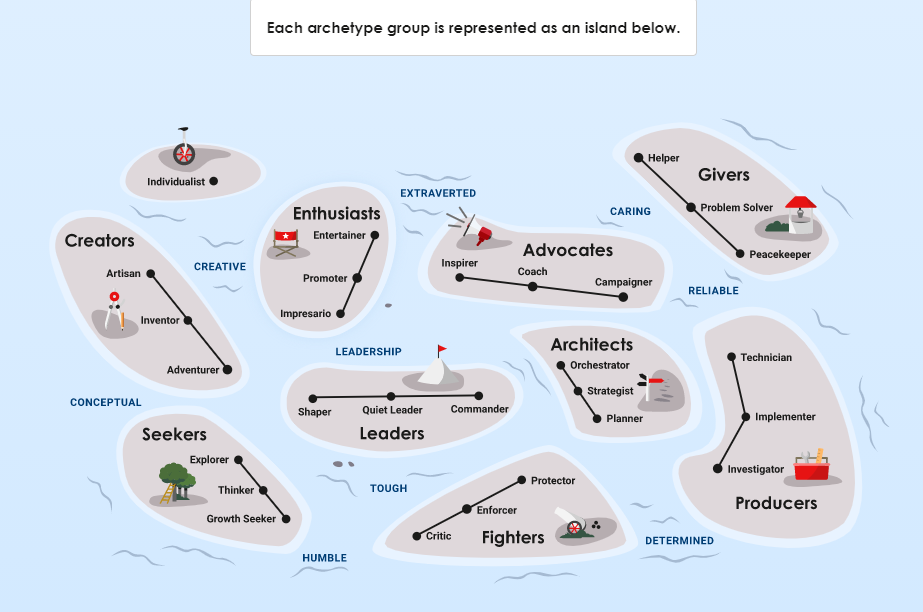

# Experience

> Try to organize my thoughts here.
>
> Experience → Memory → Opinion → Philosophy → Framework → Skill
> > Experience ≠ Memory; There are proofs in neobiology studies.
>
> Maybe should rename, but too much work: Experience → Memory → Opinion → Principal(Guidance) → Philosophy(Explain) → Skill(Formula)
>
> > Analogy: Data → Storage → Statistic → Relationship → Causation → Formula
>
> > Growth Arc(Forward): Childhood experience → Personality [(Instinct)](#personal-philosophy) → Skill → Later life experience → 🔄
>
> > Study Arc(Backward): Practice Skill → Test Memorization (school 🚫 here) → Intuitive Understanding (Framework) → Core Principals

---

## Table of Contents

- [Opinion](#opinion)
  - [China Opinion](#china-opinion)
  - [Psychology Opinion](#psychology-opinion)
  - [Economic Opinion](#economic-opinion)
- [Philosophy](#philosophy)
  - [Personal Philosophy](#personal-philosophy)
  - [Practical Guidelines](#practical-guidelines)
- [Frameworks](#frameworks)
  - [Bayesian Statisticians](#bayesian-statisticians)
  - [Life Is a Video Game](#life-is-a-video-game)
  - [Society & Time](#society--time)
  - [Science Pyramid](#science-pyramid)
  - [Brain Characteristics](#brain-characteristics)
  - [Drive toward Future](#drive-toward-future)
- [Skills](#skills)

---

## Opinion

**Summary:**  

> Opinions are patterns formed from past observations and experiences.  
>
> They are hard to change because they integrate many life events, leading to entrenched beliefs.  

- Discrete mathematics contains many fundamental principles; it should be taught in high school.
- There is no solution, only trade‑off.
- Everything has its mechanic. Understand the mechanics by either collecting statistics or applying logic.
- Most things have a recursive property (e.g., wealth, knowledge, ability, social skill).
- Structure often determines properties.
- Causation requires sequential events, which default will be computational slower than correlation.
- Every problem can break into 2 components: search & verify.
- Intelligence(Data) vs. Rationality(Radom Sample)
- We (including AI) are always biased because each of us experiences only a subset of reality.
- surprisal: Rare events contains more information.

- All evolutionary ideas challenge our assumptions.  
  > *Einstein*: E = mc² → energy and mass are equivalent.  
  > *Newton*: established modern science from religious era.
>
### China Opinion

- China is a role‑based society. Individual responsibility and power come from role rather than directly from personal choice. Hierarchical relationships arise from role assignments—for example: 君君臣臣，父父子子. 打地主
- Chinese Culture attempts to lock up human nature(不尊重人性). Ex: Buddhist can't marry nor eat meat; Communism eliminate personal profit;孔子:克己复礼;程朱理学:存天理，灭人欲。
- Chinese history often attributes the cause or outcome of events to specific individuals, which I disagrees. Life is similar to poker, perfect actions & still lose that hand. A failure does not necessarily mean a decision was wrong, just as success does not automatically justify an action.

### Psychology Opinion

- The brain is analogous to a computer: biology (hardware) + psychology (software).
- Two “minds”: the rational mind (cortex) and the emotional mind (more primitive mammalian brain).
  - cortex is slow, lazy & strong; mammalian brain is fast, restless, & gullible;
- Human nature desire for **belonging** and **power**.
  - Psychological dimensions @ Hippocampus: Power & Affiliation
- Monkey see, Monkey do.
- "Narcissism of Small Differences" Sigmund Freud
- Instinct(Personality) just understanding of risk & reward in EARLY childhood, which embedding into brain as default thinking.
- Don't trust what people said, observed their action.
- Memory exists as discrete patches; fewer patches with age make time feel faster.  
  > We don’t have a continuous memory timeline; we have denser memory patches for recent events and sparser ones for older times.  
  >> As we age, time seems to fly faster. Time does not actually speed up; rather we form fewer memory patches, which reduces the amount of change or learning because learning is the compression of those patches.  
  > Perhaps this also explains why we need less sleep as we age—sleep may normalize neuronal firing strength and frequency.  

- Decision fatigue is a real limitation.
- You cannot connect the dots when looking forward (the result has not yet occurred); you can only connect them retrospectively.
- Intelligence is an equilibrium between supply (often over‑focused) and demand (often overlooked).
- Statistic of outcome/result > Statistic of input/individual.

### Economic Opinion

- Credit Assignment is root of many problem;(wealth distribution, LLM training, learning deficit)
- Assuming unlimited supply, quality vs. price follows an exponential relationship, whereas quantity vs. price follows a logarithmic relationship.

- Trade‑off between Redundancy–Efficiency in production.
  - Redundancy Ex: China High Speed Rail over‑built due to insufficient validation. Military Industry.
  - Efficiency Ex: Textile, Automotive, Datacenter, centralize 1950 -> 2020

  - Production is centralize, inelastic;
  - Consumption is decentralize, localized, volatile;

- Technological progress fuels production efficiency, which concentrates markets; concentrated markets centralize consumption, creating the scale and resources that drive further technological progress.
  - Technological Progress → Production Efficiency → Market Concentrate → Consumption Concentrate → Technological Progress

---

## Philosophy

**Summary:**  

> Philosophy provides a way for evaluating actions, risks, and rewards.  
>
> It is typically formed early in life and guides decision‑making and trust building.

### Personal Philosophy

> I uses principle(guide) and philosophy(explain) interchangeably.
>
> Personal value is principle that individual understand in early childhood, which embedded into early layers of brain(similar to **instinct**).

**Principles:**  

- Focus should be proportional to your ability to effect change.  

- What you **DESIRE** is different from what you **NEED**.
  - Changing your path is easier than changing what you desire.  
    *Analogy*: In poker you can’t change the dealt cards, but you can control starting hands.

- Prioritize satisfaction over fleeting happiness.  

- **Bayesian Statisticians** – treat life as risk‑reward management using Bayesian updating.

- Seek satisfaction, not fleeting happiness.  
  > Most people are happy when they acquire new abilities; children are often happier because they unlock abilities more frequently.

- **Don’t trust; verify.** (Trust = verification)
  - Guide actions with philosophy to develop consistent **trust** between self and others.
  - Trust hierarchy: Unconscious < Aware < Heard < Seen < Used < Understand < Improve < Trust yourself < Others trust you.

- 不要和往事过不去，不要和现实过不去。The past cannot change; only reflection can inform future intent.

- Focus on resources that are necessary and depleting.
  - Ex: Health, Time, Attention, Social Capacity, Self Reputation(decays without upkeep), other's Goodwill or first impression(other's time);
  - C.E: Money is necessary, but not depleting. Knowledge & skill.

- There are paradox concepts/status that we never able to reach/maintain;
  - Unknown - Once you knew your unknown, you knew something about that.
  - Future - It's just concept, today is all we ever has.
  - Novelty, excitement... - Dopamine & neuron's biological nature, its effect never design to be persistent.

#### Approaches to Solution

- **Top‑down** – List possible causes, then eliminate by logic.
- **Bottom‑up** – Start with what you can do, build modules incrementally, then combine them.
- When a leader’s ego is strong, the leader becomes the ceiling for the team’s ability.

### Practical Principles

- **Transparency**: Keep decision‑making processes visible to all stakeholders; it accelerates learning and builds trust.
- **Collaboration over Speed**: Prioritize long‑term collective progress (“go together”) rather than short‑term individual speed.
- **Process Over Correctness**: Value a robust, repeatable process more than arriving at the “right” answer on the first try.
- **Risk & Reward Evaluation**: Before acting, assess both potential gains and possible downsides; use Bayesian updating to refine estimates as new information arrives.
- **Verification before Trust**: Adopt a “don’t trust; verify” mindset—seek evidence before accepting claims.
- **Decision‑Fatigue Management**: Limit the number of high‑stakes decisions in a short period; automate or delegate routine choices where possible.
- **Iterative Learning**: Treat failures as data points for Bayesian updates; slow down when high‑impact evidence appears to allow proper integration.
- **Goal Setting**: Define clear goals and rules upfront, then remain flexible to adjust consensus as new information emerges.

---

## Frameworks

**Summary:**  

- **Frameworks** are collections of philosophical principles that explain reality.  
- Good frameworks can model diverse subjects and often fall into top‑down or bottom‑up approaches.
- **Skill** is a framework in crystallized, distilled form.
  - Study Arc(Backward): Practice Skill → Test Memorization (school 🚫 here) → Intuitive Understanding (Framework) → Core Principals

### Bayesian Statisticians

> **Biological nature is about risk & reward management with Bayesian statisticians.**

- Life is a collection of habits; validation (past experiences) underpins trust.  
- Consensus stability depends on breadth of validation, information accuracy, and decision speed.  

- Life is a collection of habits.  
  - Habit and trust share the same nature: artifacts of past experiences.
- **Changes & Learning**  
  - Slow down when high‑impact evidence appears; give the Bayesian update process time to integrate it.  
  - Older organisms have less flexibility because new experiences must be diluted among many past ones.
- All interactions (communication, trade, between persons, pets, countries) require **validation** – the sum of past experiences that shape current expectations.  
  - “Connection before correction.” — *by Jane Nelsen*

> **Consensus** is common individual validation; war occurs when there is no consensus on both sides.

- Democracy increases the number of individual validations, making consensus more resilient.  
- Dictatorship has a small group consensus, enabling rapid decisions but with unstable consensus (e.g., rapid policy changes in China).
>
>> 
>>> ← dismiss validation;
>>>
>>> → value validation;
>>>
>>> ↑ seek external validation;
>>>
>>> ↓ rely on internal validation;

> Trust is having validation of your past. Trusting yourself requires remembering & reflecting on your past.

- Before you persuade others, have you been validated by others?  
  > 曹操问贾诩关于“立储”: To persuade others, your advice should be support by **THEIR** life experiences.

- **Desired Consensus = Goal**  
  Example: 刘邦斩丁公 – different goals at different times. At war, desired consensus is to defeat 项羽; after victory, the desired consensus shifts to loyalty toward 刘邦.

- **Local Consensus = Culture**
- Only pain & reflection will remove **False Validation**

  
Bayesian Examples

- People often desire power, money, and position without assuming responsibility.  
  - Parenting should be based on equal respect; teach kids that more power comes with more responsibility.  
  - Great power → great responsibility (spider‑man).  
  - Cost (risk) vs. Benefit (reward).  
  - Animal reproduction as a natural risk‑reward system.  
  - Too Good to be True Instinct in most mammals. Intelligent animals pause & think when a huge reward appears without effort/risk because intelligence instinctively measures risk.

- Why do the rich get richer? Those with resources can handle more risk to capture greater reward.

- Society pays for risk handling, not merely hard work.

- Education: we risk decades of time to increase lifelong productivity; society provides safety nets during that period.

- Charity vs. self‑interest: actions should be evaluated on net positive reward, regardless of who benefits.

- Poker exemplifies risk‑reward analysis; starting hand selection is critical.

### Life Is a Video Game

**Highlights:**  

- Player (you) chooses resources, equipment, and relationships.  
- Excess “equipment” can hinder progress; time is the ultimate resource.  

> You, the *player*, decide what to collect, explore, equip, and which relationships to form.  
> The character may acquire “equipment” (money, skill, principle, philosophy).

- Too much equipment becomes counterproductive—like junk in a hoarder’s house. The right principle is determined by your **PROBLEM** (“game”).  
- Money amplifies true nature: *Money is like a mushroom in Super Mario, making you bigger.*  
- The hardest problem is the “player‑control bug” → mental disability.  
- Lack of education & pattern recognition = player doesn’t know the game rules.

> Happiness comes from the player, not the character. Many confuse the two.  
> The only resource a player has is time.

### Society & Time

**Highlights:**  

- Society functions like a rope: population = thickness, time = length.  
- Individuals are fibers transmitting opinions and knowledge across generations.  

> Society ≈ rope: population = thickness, time = length. Individuals are fibers carrying opinions, experiences, and knowledge. Forces can pass to next generations, friends, families, or coworkers. External shocks (natural disasters) are like sudden forces on the rope; some strands lead nowhere.

### Science Pyramid

1. Mathematics → 2. Physics → 3. Chemistry → 4. Biology → 5. Psychology → 6. Sociology

### Brain Characteristics

**Core Traits:**  

- Rational (slow, accurate) vs. Emotional (fast, heuristic).  
- Cortex “parenting” of the cerebrum; connection before correction; decision fatigue.  

1. Rational (slow, accurate) vs. Emotional (fast, heuristic)  
2. Parenting (cortex “parenting” of the cerebrum)  
3. Connection before correction  
4. Decision fatigue  

### Drive toward Future

**Key Points:**  

- Visibility, controllability, and backup systems enhance resilience.  
- Faster speed isn’t always optimal; balance cost, reliability, and diversity.  

1. The road is not always straight; visibility is limited.  
2. Drivers have some control of the car.  
3. Cars have momentum from past acceleration.

> Heading in a “wrong” direction now doesn’t mean the path is wrong forever.  
> End‑of‑world predictions fail because they assume a static future.

**Key actions for resilience**

1. Increase visibility (better prediction).  
2. Improve controllability (better production, storage, response systems).  
3. Maintain backup systems.

> “Better” means lower cost **and** higher reliability, diversity, and reduced unknown impact. We may not want to drive at maximum speed.

## Skills
>
> Books is collection of skills by author, which supports by their life experiences.
> Ex: A formula(skill) is a condensed version of mathematical principles.

> Here are skills that contain important philosophies.

- discrete math
- poker probability
- Biodiversity
- Psychology

The higher percentile on skillet, the more like absolute dominant over lower percentile.
Ex: 99 percentile will have 99% chance to beat 90% percentile;
But 90 percentile only have 70% beat 80 percentile.
In math term: higher percentile reduce variance. lower percentile increase variance.
